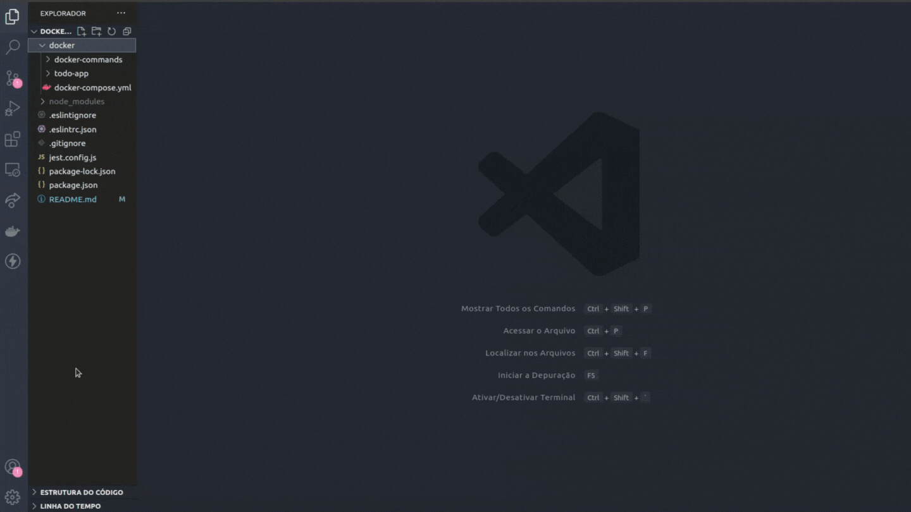

# Projeto Docker Todo List

:rocket: *Projeto desenvolvido em 05/2022 - Bloco 19/Trybe*

## :dart: Objetivo

Desenvolver arquivos de configuração afim de conteinerizar a aplicação para que ela funcione corretamente em três frentes: Front, Back e Tests.

Sendo a de Tests para verificação se as anteriores estão se comunicando.

### Como funciona?

- Cada arquivo *command* equivale a um comando docker utilizado

- Para buildar as imagens de acordo com cada frente, foi criado um arquivo *Dockerfile* para cada diretório especifico

- Ao final é realizado a orquestração das aplicações com o *docker-compose*

***Localizados em:***

**Comandos:** *./docker/docker-commands*

**Front:** *./docker/todo-app/front-end/Dockerfile*

**Back:** *./docker/todo-app/back-end/Dockerfile*

**Testes:** *./docker/todo-app/tests/Dockerfile*

**Docker-compose:** *./docker/docker-compose.yml*

## :brain: Habilidades desenvolvidas

- Utilizar comandos do docker para criar, listar, executar e remover containers
- Criar arquivos de build com o *Dockerfile*
- Subir uma orquestração em segundo plano com o *docker-compose*

## :hammer_and_wrench: Ferramentas utilizadas

- Docker

:zap: *Todos os projetos da [Trybe](https://www.betrybe.com/?utm_medium=cpc&utm_source=google&utm_campaign=Brand&utm_content=ad03_din_h&gclid=Cj0KCQjw852XBhC6ARIsAJsFPN0TgLB25i-0iaTXpXGAYC5i-3mDoTto4laUGYI5XZFJpSlNbrojLuUaAs6cEALw_wcB) utilizam Linters, Git e Github*

## :mag: Observações

Com exceções dos arquivos de comandos do docker, dockerfile e docker-compose, o restante da aplicação foi disponibilizada pela [Trybe](https://www.betrybe.com/?utm_medium=cpc&utm_source=google&utm_campaign=Brand&utm_content=ad03_din_h&gclid=Cj0KCQjw852XBhC6ARIsAJsFPN0TgLB25i-0iaTXpXGAYC5i-3mDoTto4laUGYI5XZFJpSlNbrojLuUaAs6cEALw_wcB).

## :mailbox: Contatos

